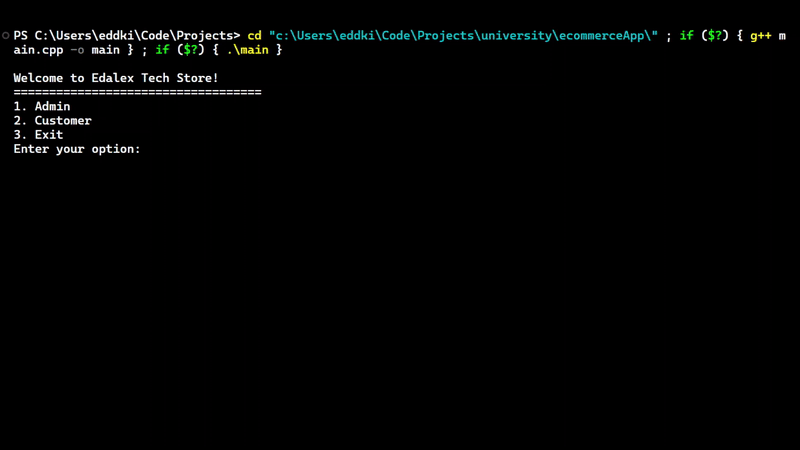

# Edalex Tech Store

Welcome to the Edalex Tech Store project! This is a C++ application for managing a tech store, featuring functionalities for both admins and customers. Below is a detailed description of the features, usage, and contribution guidelines.

## Live Demo



## Open in GitHub Codespaces

Open this project in GitHub Codespaces to interact with it. Click the button below:

[](https://github.com/codespaces/new?hide_repo_select=true&ref=main&repo=Eddking-QS/Projects-eCommerce_App)

## Features

### Admin Features

-   **Sign Up**: Create a new admin account.
-   **Sign In**: Log into an admin account.
-   **Search Products**: Search for products within specific categories.
-   **Add Categories**: Add new product categories.
-   **Add Products**: Add new products to categories.
-   **Delete Categories**: Remove existing categories.
-   **Delete Products**: Remove existing products.
-   **Add Customers**: Register new customers.
-   **Delete Customers**: Remove customers.
-   **Backup Products**: Backup product data.
-   **Backup Customers**: Backup customer data.

### Customer Features

-   **Sign Up**: Create a new customer account.
-   **Sign In**: Log into a customer account.
-   **View All Products**: Display all available products.
-   **View Categories and Products**: Display all categories and select products within them.
-   **Search Products**: Search for specific products.
-   **View Cart**: View products added to the cart.
-   **View Favorites**: View favorite products.
-   **Checkout**: Purchase products in the cart.

## Usage

1. **Admin Login**:

    - Follow the prompts to sign up or sign in.
    - Once logged in, access admin-specific features.

2. **Customer Login**:

    - Follow the prompts to sign up or sign in.
    - Once logged in, access customer-specific features such as viewing products, adding to cart, and checking out.

## Contribution

Contributions are welcome! Please follow these steps:

1. Fork the repository.
2. Create a new branch:

    ```bash
    git checkout -b feature/your-feature-name
    ```

3. Make your changes and commit them:

    ```bash
    git commit -m 'Add some feature'
    ```

4. Push to the branch:

    ```bash
    git push origin feature/your-feature-name
    ```

5. Open a pull request.
